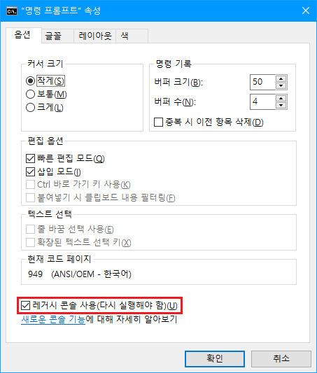

# My Small Basic experiments
## 개요
제가 고등학교 다닐 적에 프로그래밍 교육을 목적으로 만들어진 **Visual Basic** 의 하위 호환인 
**Small Basic**이란 언어를 통한 수업이 있었습니다. 
<u>그리는 부분 쪽으로 함수와 기능이 있어</u> 개인적인 흥미와 재미로 여러가지를 만들었던 것들을 
이 리포지토리에 보관하게 됐습니다.

제게 있어서 과거의 기록물이기 때문에, 코드를 손 보지 않고 그대로 올렸습니다.

## 실행파일(.exe)에 대해...
exe를 실행할 때, 대부분 Bash(cmd) 창이 같이 뜹니다. 
**Windows 8 이상일 때 일부 실행 파일의 화면에서 프레임 갱신이 느려지는 현상이 발생할 수 있습니다.** 
이럴 때에는 아래의 사진처럼 <u>Bash 창을 레거시로 변경</u>해야 잘 작동합니다. 
 
`Bash 창 우클릭 -> 속성`에서 변경 가능합니다. 
Windows 7에서는 정상작동합니다.